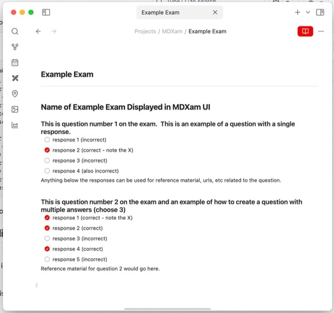
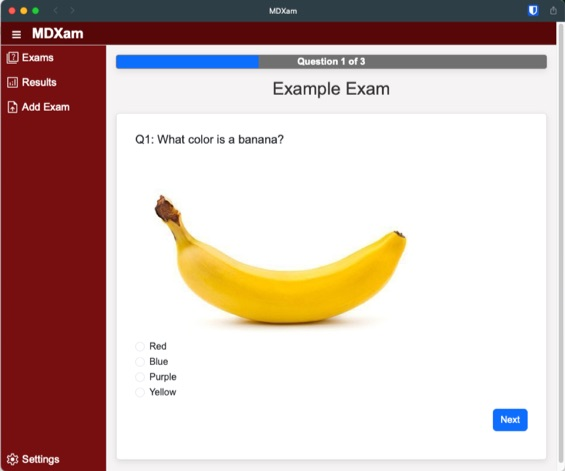

#  MDXam - Markdown Exam Simulator

Have you ever wanted an easy way to take an exam study guide and quickly turn it into flash cards or an exam simulation?  Better yet, what if you could create those study guides with a simple text editor?  That is the fundamental goal of [MDXam](https://msalty.github.io/mdxam/) (<ins>**M**</ins>ark<ins>**d**</ins>own e<ins>**Xam**</ins>).  

[MDXam](https://msalty.github.io/mdxam/) is a mobile-first exam simulation application.  Don't let "mobile-first" scare you off - it works great as a lean app on any modern desktop OS as well. It will allow you to upload, take, and review exams written in [Markdown](https://www.markdownguide.org) syntax (so... text-based, DRM-free, unecrypted, and fully created and controled by you). The application is designed to work easily and offline using browser-based storage. It offers customizable themes, real-time exam simulation with progress tracking, randomized questions and answers, and detailed result review on missed questions with charts to review progress.

<a href="https://www.buymeacoffee.com/msalty" target="_blank"></a>

## Table of Contents

- [Installation & Setup](#installation--setup)
  -  [Android](#android)
  -  [IOS](#ios)
  -  [Desktop](#desktop)
    - [Google Chrome](#google-chrome) 
- [Usage](#usage)
  - [Uploading an Exam](#uploading-an-exam)
  - [Taking an Exam](#taking-an-exam)
  - [Reviewing Results](#reviewing-results)
  - [Theming](#theming)
- [Creating Exams](#creating-exams)
  -  [Exam Format](#exam-format)
  -  [Including Images and HTML Tags in Exam Files](#including-images-and-html-tags-in-exam-files)
- [Service Worker & Offline Support](#service-worker--offline-support)
- [Storage](#storage)
- [Customization](#customization)
- [Features](#features)
- [Troubleshooting](#troubleshooting)
- [License](#license)

## Installation & Setup

### Android
Instructions for installing MDXam on Google Android devices:
- Visit [MDXam here on GitHub Pages](https://msalty.github.io/mdxam/)
  - Modern versions of Android may pop up an "Install" button immediately
- Click on the KEBAB MENU in the upper-right of mobile Chrome
- Select "Add to home screen"
- Choose the "Install" option.  It will work like a normal Android app even offline.


### IOS
Instructions for installing on Apple iPhone and Apple iPad:
- Visit [MDXam here on GitHub Pages](https://msalty.github.io/mdxam/) 
- Click on the SHARE button at the bottom of mobile Safari
- Select "Add to Home Screen"
- Select "Add" on follow up page to install to your iPhone.  It will work like a normal app even when offline.


### Desktop

#### Google Chrome
Instructions for installing on desktop via Chrome (also works on ChromeOS):
- Visit [MDXam here on GitHub Pages](https://msalty.github.io/mdxam/)
- In the Chrome Search Bar ("Omnibox") you should see an install icon
- Click on it and choose the "Install" option and it will be installed as an app on your machine


## Usage

### Uploading an Exam

1. Navigate to the **Add Exam** section via the left navigation bar.
2. Select your exam file (a Markdown file) along with any associated image files (shift select / option select / select all for multiple files if including a bunch of images).
3. The app processes the Markdown, converting custom image syntax to embedded images (using data URLs).
4. After upload, you see a confirmation and are automatically redirected to the **Exams** list.

### Taking an Exam

1. On the **Exams** page, click the "Open" button on an exam to open it.
2. The exam simulation begins:
   - Questions are presented in a randomized order.
   - Answer choices are also randomized.
   - A progress bar at the top shows your progress, with the current question number centered over the entire bar.
3. You can navigate between questions using **Previous** and **Next** buttons, then **Submit Exam** when finished.
4. You may delete an exam by hitting the "Delete" button next to it (the red "X")

### Reviewing Results

1. After submitting an exam, your results (score, date, attempt details) are stored.
2. Navigate to the **Results** section to view a summary:
   - Each exam’s results are displayed with a header styled like the Exams page (including exam name, an "Open" button, and delete controls).
   - A chart shows your exam score over multiple attempts.
   - A table lists each attempt.
   - You can click on **Review** to view missed questions, with the option to filter to only missed questions.
3. You can also delete all results for an exam from this page.

### Theming

1. Go to **Settings**.
2. Select a theme from the dropdown (e.g., Storm or Redshift).
3. The top nav bar, left nav bar, main content, and even the body background will update to match the chosen theme.
4. The selected theme is stored and applied on subsequent visits.

## Creating Exams

Making the exams both easy to create and human-readable was of paramount importance to this project.  I wanted an exam I could load into a markdown editor and modify as needed in a format that was both universal and durable.

### Exam Format

The below exam can be copy and pasted into a text file with the `.md` (markdown) extension and uploaded to MDXam.

```
# Name of Example Exam Displayed in MDXam UI

## This is question number 1 on the exam.  This is an example of a question with a single response.
- [ ] response 1 (incorrect)
- [x] response 2 (correct - note the X)
- [ ] response 3 (incorrect)
- [ ] response 4 (also incorrect)
Anything below the responses can be used for reference material, urls, etc related to the question.

## This is question number 2 on the exam and an example of how to create a question with multiple answers (choose 3)
- [x] response 1 (correct - note the X)
- [x] response 2 (correct)
- [ ] response 3 (incorrect)
- [x] response 4 (correct)
- [ ] response 5 (incorrect)
Reference material for question 2 would go here.
```

When viewed in a proper Markdown editing tool (such as [Obsidian](https://obsidian.md)), the exams should be very easy to both read and print.  



### Including Images and HTML Tags in Exam Files

To make the format more flexible, you can include images (as many as you want) in each question along with html tag elements.  Below is an example question that contains an image and an HTML tag.

```
## What color is a banana? </br> ![[banana.jpg]]
- [ ] Red
- [x] Yellow
- [ ] Blue 
- [ ] Purple 
```

You will need to upload both the exam `.md` file and images files with names that match those included in the exam questions (e.g. `banana.jpg` in the above example). The questions will be rendered with the image included.



## Service Worker & Offline Support

- **Installation:**  
  The service worker defined in `sw.js` caches all essential files (HTML, CSS, JS, icons, etc.) for offline use.
  
- **Update Cycle:**  
  The service worker version is managed via the `CACHE_NAME` variable. When updated, the worker cleans up old caches.
  
- **Cache Strategy:**  
  The service worker uses a cache-first strategy. This ensures that when offline, the app will load from cache.

## Storage

- **Exams:**  
  Uploaded exams are stored in IndexedDB under an object store named `exams` (keyed by `id`).

- **Exam Results:**  
  Results are stored in IndexedDB under the `examResults` object store, with each record using an inline key (`examId`) and an array of result attempts.

- **Quota:**  
  IndexedDB has a much larger quota than localStorage, making it suitable for storing larger files (including images).

## Customization

- **Randomization:**  
  Exams are randomized (both questions and answer choices) each time they are loaded.
- **Styling:**  
  You can modify `style.css` to change the appearance of the navigation bars, progress bars, and other UI elements.
- **Themes:**  
  Edit the `applyTheme()` function in `main.js` to add more themes or modify the existing color schemes.

## Features

- **Offline Functionality:**  
  Utilizes a Service Worker to cache assets (HTML, CSS, JS, icons, etc.) so the app works reliably offline.
  
- **Exam Upload & Parsing:**  
  - Exams are uploaded as Markdown files.  
  - The parser supports custom image syntax (e.g., `![[banana.jpg]]`), with images converted to data URLs for offline use.
  - The app randomizes the order of exam questions and, optionally, answer choices.

- **Exam Simulation:**  
  - A progress bar tracks the exam’s progress.
  - Navigation buttons allow users to move between questions.
  - The progress bar displays text over the entire bar regardless of fill.

- **Results & Review:**  
  - Exam results (score, date, attempt details) are stored in IndexedDB.
  - A results view displays a chart (using Chart.js) of past attempts.
  - Users can review each exam attempt, with incorrect questions highlighted.
  - A header for each exam in the Results view mimics the styling of the Exams page, including “Open” and “Delete All Results” controls.
  - Exams in both the Exams and Results views are alphabetized.

- **Theming:**  
  Users can select a theme from a drop-down menu in the settings. Themes change the color of the top navigation bar, left navigation bar, and main content area.

## Troubleshooting

- **Service Worker:**  
  If you update your assets, remember to update the cache version in `sw.js` to force a refresh.
- **Caching Issues:**  
  Clear your browser cache or use incognito mode if changes aren’t reflected.
- **Storage Quota:**  
  If you encounter quota errors, check the size of the uploaded files (especially images). Consider using data URL conversion for offline persistence.

## License

This project is licensed under the MIT License – see the [LICENSE](LICENSE) file for details.
